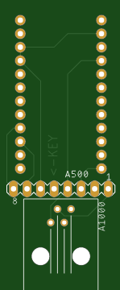
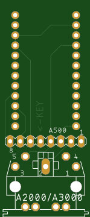
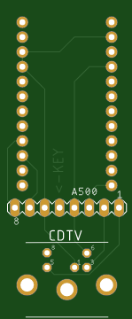
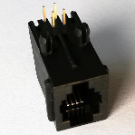

This directory contains boards (as EAGLE CAD files) that can be used in combination with the [code in this repository](..).

They allow to create a DIY adapter which requires three things:
* A "Pro Micro" Arduino clone (5 Volt version)

* One of the adaptor boards fitting to the keyboard you want to use (the A500 pin header can be used on any of the boards)
  * A1000 ([pcbway link](https://www.pcbway.com/project/shareproject/Amiga_1000___500_Keyboard_USB_adapter.html))
  * A2000 / A3000 ([pcbway link](https://www.pcbway.com/project/shareproject/Amiga_2000___3000___500_Keyboard_USB_adapter.html))
  * A4000 / CD32 ([pcbway link](https://www.pcbway.com/project/shareproject/Amiga_4000___CD32___500_Keyboard_USB_adapter.html))
  * CDTV ([pcbway link](https://www.pcbway.com/project/shareproject/Amiga_CDTV___500_Keyboard_USB_adapter.html))

* The corresponding socket to attach the keyboard to:
  * A1000: 4P4C socket
  * A2000 / A3000: 5 pin DIN socket
  * A4000 / CD32: 6 pin mini-DIN socket
  * CDTV: 5 pin mini-DIN socket
  * A500: 8 pin standard 2.54 mm (0.1 in) pin header

To build one of these just solder the "Pro Micro" board and the socket or pin header on the adaptor board, create a solder bridge on J1 of the "Pro Micro", and flash the [software](..).

3D printable cases for the boards can be found at https://www.thingiverse.com/thing:4593520

***DISCLAIMER:***

This hardware/software is provided "as is", and you use the hardware/software at your own risk. Under no circumstances shall any author be liable for direct, indirect, special, incidental, or consequential damages resulting from the use, misuse, or inability to use this hardware/software, even if the authors have been advised of the possibility of such damages.
